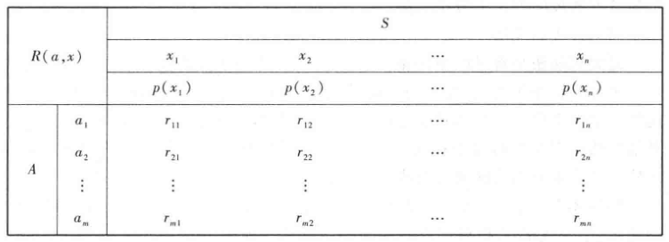
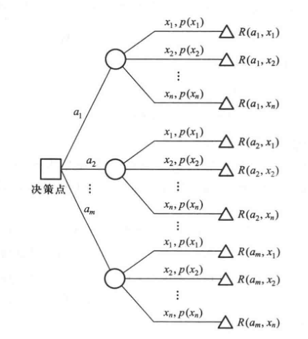

# 决策分析

## 基本概念

- **确定型决策**：完全掌握决策后的未来信息
- **风险型决策**：知道未来的概率分布
- **不确定型决策**：均未知
- **状态集**：所有可能的自然状态的集合 $S = \{x\}$
  - **状态发生的概率**：$P(x)$
  - **自然状态**：
- **决策集**：
  - **决策方案**：决策的行动方案
  - **决策变量 $a$**：数量化的决策方案
  - **决策集 $A = \{a\}$**：决策变量的全体
- **报酬函数**：$R: A\times S，(a,x)\mapsto r$
  - **收益值**：$r$
- **决策准则 $\Phi$**：寻找最佳决策方案所采取的准则

### 数学模型（决策表）

## 风险型决策分析

- **条件**：
  - 存在目标
  - 存在多种自然状态
  - 存在不同方案
  - 方案在自然状态下的报酬值可计算
  - 自然状态的概率可计算

### 基本方法

- **最大可能法**：只考虑最大可能的自然状态，将其概率视为 $1$，并以此决策
- **步骤**：
  - 明确目标
  - 寻找自然状态 $S$，确定概率 $p(x)$
  - 列出不同方案 $A$
  - 确定报酬函数 $R(a,x)$
  - 列出决策表并计算
  - 确定决策准则：$\Phi: \max\limits_{a\in A} \{R(a,x_{j0})\}$ 或 $\min\limits_{a\in A} \{R(a,x_{j0})\}$
- **期望值法**：
  - 计算每个方案的期望报酬值
  - 确定决策准则：$\Phi: \max\limits_{a\in A} \{E(R(a,x_{j0}))\}$ 或 $\min\limits_{a\in A} \{E(R(a,x_{j0}))\}$

### 决策树

- **本质**：期望值法的图解形式
- **决策点**：树的根节点
  - **方案枝**：表示可行方案
    - **状态点**：表示自然状态
      - **概率枝**：表示该状态发生的概率
        - **报酬值**：表示该状态下该方案的报酬值

- **分析法**：计算期望值，保留最优方案，减去其他方案

## 不确定型决策分析

- **条件**：
  - 存在目标
  - 存在多种自然状态
  - 存在不同方案
  - 方案在自然状态下的报酬值可计算
  - （少个自然状态的概率）

### 基本方法

- **乐观法**：对每个方案取最有利的状态，计算报酬值，并采用最大报酬值的方案
- **悲观法**：
- **乐观系数法**：
  - **乐观系数**：$\a$
  - **决策准则**：$\Phi: \max\limits_{a\in A} \Big\{ \a\max\limits_{x\in S}\{R(a,x_{j0})\} + (1-\a)\min\limits_{x\in S} \{R(a,x_{j0})\}\Big \}$
    - **本质**；取该方案在系数影响下的利润最大的 $a$
- **后悔值法**：使得后悔可能最小
  - **后悔值**：$RV(a,x) = \max\limits_{a\in A} \{R(a,x)\} - R(a,x)$
    - 相对于该自然状态 $x$ 下的最大利润方案 $a_{max}$，目前选择的方案 $a$ 会相对少多少利润
  - **决策准则**：$\Phi: \min\limits_{a\in A} \set{ \max\limits_{x\in S} RV(a,x_{j0})}$
    - **本质**：取（该方案下可能出现的最大后悔值）最小的 $a$
- **等可能法**：各种自然状态发生几率等可能
  - **决策准则**：$\Phi: \max\limits_{a_i\in A} \set{ \dfrac{1}{n}\sum\limits^n_{j=1} R(a_i,x_j)}$
    - **本质**：计算各方案下，不同自然状态利润的算术平均值，采用平均值最大的方案

## 效用函数

- **报酬集 $R$**：决策问题中所有报酬的集合
- **序公理**：$R$ 是全序集
- **传递性公理**：$R$ 的序关系可传递
- **效用函数**：定义在 $R$ 上的单增函数 $u(r)$，依赖于决策者对 $r$ 的偏好程度
- **方案的效用值**：$u(a) = \sum\limits_{x\in S} p(x)u(R(a,x))$
  - **本质**：方案 $a$ 下，可能出现的各个利润值 $r_i$ 对应的效用值 $u_(r_i)$，被（该利润值的自然状态概率 $p_i$ ）加权后，计算加权平均值
- **效用函数法**：取使效用函数最大的 $a$
  - **决策准则**：$\Phi:\max\limits_{a_i\in A} \{u(a_i)\}$
- **效用曲线**：效用函数的图像
  - 保守型：下凸
  - 中间型：直线
  - 冒险型：上凸

### 信息价值

- **咨询结果**：$Z = \{z_1,\cdots,z_n\}$
- **先验概率（主观概率）**：凭个人主观意志得出的状态概率
- **后验概率**：先验的基础上咨询得到的新概率分布
- **计算信息价值**
  - 利用先验概率分布，求出各方案期望报酬值 $p(x)$
    - **本质**：风险型的期望值法
  - 根据咨询信息，计算各状态后验分布 $p(x|z)$
    - **本质**：在咨询结果咨询，
  - 计算各方案的后验期望报酬
    - **本质**：风险型的期望值法
  - 对 $z$ 的每一个值，选取最大后验期望报酬 $R^*(x,z)$
  - 计算**咨询的信息价值**：$E(R^*(x,z)) - E(R)$
    - **本质**：（咨询后，采取最有利方案后的利润） - （未咨询，采取最有利方案后的利润）

#### 例题

- **已知**
  - 先验概率 $p_j$、利润表 $r(a_i,p_j)$
  - 咨询正确错误率 $p(z|x)$
  - 咨询费用 $w$
- **分析**：是否值得查询
- **解**：
  - **求后验概率（贝叶斯公式）**：$p(x_j|z_i) = \cfrac{p(x_j\cap z_i)}{p(z_i)} = \cfrac{p(z_i|x_j)p(x_j)}{\sum\limits_{j=1} p(z_i|x_j)}$
  - **计算后验期望**：$E(a_i,z_j)$
    - 对每个 $z_j$，取最大的期望的 $a_i$
      - **计算各个 $z_j$ 的最大期望** $R^*(x,z_j)$
  - **计算价值信息**：$E(R^*(x,z)) - E(R)$
    - **本质**：各个咨询情况的利润期望 - 不咨询的利润期望
  - 最后和咨询费用 $w$ 进行比较，判断是否值得咨询