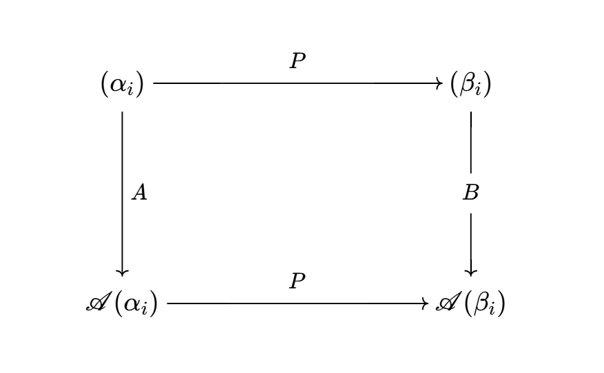
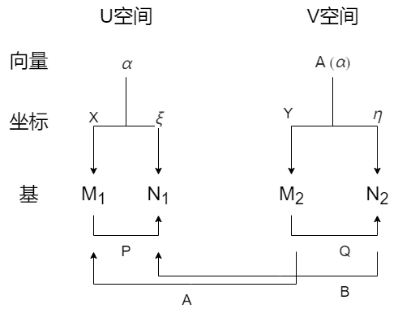
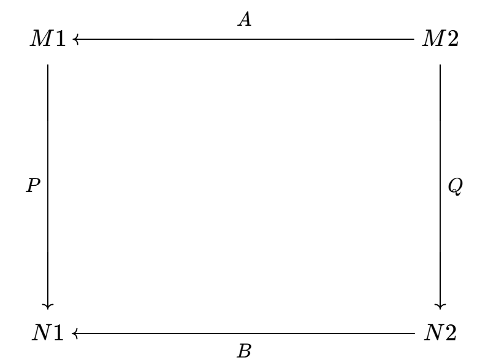

# 线性映射

<!-- - 线性映射其实应该和线性变换综合来看，首先线性映射把 $\alpha$ 映成 $\mathscr{A}(\alpha)$，然后线性变换求 $\mathscr{A}(\alpha)$ 在 $\beta$ 下的坐标阵 -->
- **符号约定**：
  - 所有向量都是列向量
  - $(\e_1,...,\e_n)$ 表示 $n$ 维线性空间的一组基矩阵（以基向量 $\e_1,\e_2,...,\e_n$ 为列向量的矩阵），一般简写为 $(\e_i)_n$
  - $\ms A(A)$ 表示对矩阵 $A$ 的所有列向量作用 $\ms A$，然后将像按原顺序并排写成的新矩阵
    - 比如 $\ms A(\e_1,...,\e_n)$ 表示对基矩阵中的所有基向量进行映射后所形成的新矩阵
  - $X_n$ 表示 $n$ 维向量，$U$ 和 $V$ 分别表示 $n,m$ 维线性空间

## 基础

- **线性映射**：设 $U,V$ 是数域 $F$ 上的线性空间，映射 $\ms A:U\to V$ 若满足线性性质（加性和齐性），则称为线性映射
  - **加性**：$\ms A(\a + \b) = \ms A(\a) + \ms A(\b)$
  - **齐性**：$\ms A(\l\a) = \l\ms A(\a)$
- **线性变换**：定义域与陪域相同的线性映射
- **特殊的线性变换**：
  - 单位变换 $\mathscr{E}(\alpha) = \alpha$
  - 零变换 $\mathscr{O}(\alpha) = \vec{0}$
  - 数乘变换 $\mathscr{K}(\alpha) = k\alpha$
  - 微商映射 $\mathscr{D}$
  - 积分映射 $\mathscr{J}$

### 习题

- 可逆线性变换把直线变成直线
  - **证明**：写出表达式即可
- 非线性空间之间不可能存在线性映射
  - **证明**：实际上非线性空间上都无法定义线性映射
- 线性空间之间可能存在非线性映射
  - **实例**：$f:\R\to\R，x\mapsto x^2$

## （王萼芳）线性变换

### 线性变换和矩阵

- **线性变换对基的唯一性**
  - 设 $\{\e_i\}$ 是一组基，若 $\mathscr{A}(\varepsilon_i) = \mathscr{B}(\varepsilon_i)$，则 $\mathscr{A} = \mathscr{B}$
  - **证明**：见下面
  - **理解**：线性变换相等的定义：对每个向量作用相同
- **基变换**
  - 设 $\{\e_i\}$ 是一组基
  - 则对任意一组基 $\{\alpha_i\}$，都存在唯一的线性变换 $\mathscr{A}$ 使得 $\mathscr{A}(\varepsilon_i) = \alpha_i$
  - **证明（就是李的线性扩张定理）**
    - 设 $\xi = \sum x_i\varepsilon_i$，则满足 $\mathscr{A}(\xi) = \sum x_i\alpha_i$ 的线性变换即为所需变换
  - **理解**：把多个向量（基）换成一个向量（$\alpha$），就可以构造变换
    - 因为线性变换线性的本质是对每个向量都有相同的处理方法，也就是矩阵的左列右行，所以无法对多个向量分别构造变换，还能保证它是一个整体变换在不同向量 $\varepsilon_i$ 上的体现
    - 除非这些变换都具有统一的形式，即对它们组合而成的向量 $\xi$ 定义整体变换
- **矩阵乘法性**：线性变换本质是矩阵的乘法
  - $\mathscr{A}(\varepsilon_1,\varepsilon_2,...,\varepsilon_n) = \Big(\mathscr{A}(\varepsilon_1),...,\mathscr{A}(\varepsilon_n)\Big) = (\varepsilon_1,\varepsilon_2,...,\varepsilon_n )A$
  - **矩阵理解**：基在这里可以看作列向量，所以上面其实是矩阵的左列右行
  - **方程组理解**：本质是代入
  - **证明（就是李的坐标阵定理）**
- **乘法翻转性**：设 $\begin{cases} \ms A(\e_i)_n = (\e_i)_nA = (\a_i)_n \\ \ms B(\e_i)_n = (\e_i)_nB = (\b_i)_n \end{cases}$，则 $(\mathscr{AB})(\e_i)_n = (\e_i)_n AB$
  <!-- - **相似证明**：
    - 设 $\mathscr{A}$ 在基 $(\beta_i)$ 下的矩阵为 $B_A$，则有 $\mathscr{AB}(\e_i) = \mathscr{A}[(\e_i)B] = \mathscr{A}(\beta_i) = (\beta_i)B_A$
    - 易得 $B_A = B^{-1}AB$，从而原式化为 $(\alpha_i)B(B^{-1}AB)$，**证毕**
  - **映射证明**：
    - $\mathscr{AB}(\e_i) = \mathscr{A}\Big[\mathscr{B}(\e_1),...,\ms B(\e_n)\Big] = \Big[ \mathscr{B}(\e_1),...,\ms B(\e_n) \Big]A = \mathscr{B}\Big[(\e_1,...,\e_n)A\Big] = (\e_1,...,\e_n)AB$，**证毕** -->
  - **证明**：
    - 设 $B = (b_{ij})_{n\times n}$，则易得 $\b_i = \sum\limits^n_{j=1}b_{ij}\e_i$
    - 则 $\ms{AB}(\e_i) = \ms A\Big( \sum\limits^n_{j=1} b_{1j}\e_1,\cdots,\sum\limits^n_{j=1}b_{nj}\e_n \Big) = \Big( \sum\limits^n_{j=1} b_{1j}\ms A(\e_1),\cdots,\sum\limits^n_{j=1}b_{nj}\ms A(\e_n) \Big) = \Big( \sum\limits^n_{j=1} b_{1j}\a_1,\cdots,\sum\limits^n_{j=1}b_{nj}\a_n \Big) \\ = (\a_i)B = (\e_i)AB$
  - **理解**：
    - 因为线性变换是直接作用于基的，坐标阵的意义只是对基的线性组合

## （李尚志）线性映射

- **U在V上的退化**：将高维空间 $U$ 映入低维空间 $V$ 的线性映射
  <!-- - （多出的分量必定线性相关，可直接消去） -->
- **U在V上的嵌入**：将低维空间 $U$ 映入高维空间 $V$ 的线性映射
  <!-- - （多余的分量变为0） -->

### 线性映射的矩阵

- **线性映射的矩阵（基写法）**：
  - 对于任意线性映射 $\ms A$、基矩阵 $(\a_i)_m$、基矩阵 $(\b_i)_n$，都存在矩阵 $A_{m\times n}$ 使得 $\mathscr{A}(\alpha_1,...,\alpha_n) = (\beta_1,...,\beta_m)A_{m\times n}$
  - 上面的 $A$ 称为 $\mathscr{A}$ 在两个基 $(\a_i)_n,(\b_i)_n$ 下的矩阵
  - **坐标性**：$A$ 的列向量 $A_i$ 就是基 $(\a_i)_n\in U$ 的像 $\ms A(\a_i)\in V$ 在基 $(\beta_i)_n\in V$ 下的坐标
  - **证明**：由于 $(\b_i)$ 是一组基，故每个向量 $\ms A(\a_i)$ 都可被它线性表出。将这些线性表出式合起来写成矩阵乘积形式就得到 $A_{m\times n}$
  - **推论**：退化映射的矩阵是横条阵 $A_{m×n}\pad (m<n)$，但嵌入映射的矩阵是方阵 $A_{m\times m}$
- **线性映射的矩阵（坐标写法）**：
  - 任意线性映射都可以表示为 $\sigma:F^n\to F^m，X_n\mapsto A_{m\times n}X_n$
    - 其中 $X_n$ 是原像向量 $\a$ 在 $U$ 的某组基 $\{\a_i\}_n$ 下的坐标
    - 其中 $A_{m\times n}X_n$ 是像向量 $\ms A(\a)$ 在 $V$ 的某组基 $\{\b_i\}_m$ 下的坐标
  - **证明**：
    - 设 $\ms A(\a) = \b$，$X_n$ 是 $\a$ 在基 $(\a_i)_n$ 下的坐标，$Y_m$ 是 $\b$ 在基 $(\b_i)_m$ 下的坐标
    - 则 $\sigma(X_n) = Y_m = A_{m\times n}X_n$ 就是相应的数组空间线性映射，显然它和 $\ms A$ 是一一对应的
    - 详细过程就是下面线性映射矩阵唯一性的证明
  - 一般我们都是在数组空间中讨论向量，在讨论其它的线性空间之前也会先找出一组比较自然的基，从而把所有向量都写成坐标的形式（即同构到数组空间）
  - 但在某些线性空间（比如矩阵空间）中，写成坐标形式反而会更加麻烦，不如直接用基向量的形式
<!-- - **基映射和坐标映射**：
  - 若已知线性映射 $\ms A:U\to V$ 和两组基 $(\a_i)_m\in U，(\b_i)_n\in V$
  - 则可确定一个数组空间的线性映射 $\sigma:F^m\to F^n$
  - $\sigma$ 称为 $\ms A$ 在两组基下的坐标映射。原来的变换 $\ms A$ 也称为基映射 -->
- **两种写法的等价性**：两种写法中的 $A_{m\times n}$ 是相同的
  - **证明**：
    - 设 $\sigma_1，\sigma_2$ 分别是将向量 $\a\in U,\b\in V$ 变为其在基 $(\a_i)_n,(\b_i)_m$下的坐标 $X_n,Y_m$ 的同构
      - 易得此时坐标映射 $\sigma = \sigma_2\ms A\sigma_1^{-1}$
    - 首先用基 $(\a_i)_n$ 线性表出 $\alpha$
      - $\alpha = (\alpha_1,...,\alpha_n)X_n = \sum x_i\a_i$
    - 等式两边作用 $\ms A$ 得
      - $\b = \mathscr{A}(\alpha) = \sum x_i\ms A(\a_i) = \Big(\ms A(\a_i)\Big)X_n$
    - 等式两边作用 $\sigma_2$ 得
      - $Y_m = \sigma_2(\beta) = \sum x_i\sigma_2\Big(\mathscr{A}(\a_i)\Big) = \Big(\sigma_2\ms A(\a_i)\Big)X_n$
    - 最后取 $A_{m\times n} = \sigma_2\ms A(\a_i)$
      - 由 $\sigma_2$ 的定义，$A$ 就是基写法中 $\ms A$ 的矩阵
      - 由 $Y_m$ 和 $X_m$ 的定义，$A$ 就是坐标写法中 $\sigma$ 的矩阵
  - **理解**：
    - 任意线性空间都与数组空间同构，其中一种同构映射就是坐标映射（显然不只有一种同构方法），上面的过程只是说明了这种同构关系

### 线性变换的矩阵

- **线性变换的矩阵**：若 $U = V$，则 $\ms A$ 退化为线性变换，此时有：
  - $A$ 是方阵
  - 基写法变为 $\ms A(\a_i) = (\a_i)A$
  - 坐标写法变为 $\ms A(X) = AX$
  - 原来需要两组基，现在只需要一组基
  - 实际上高代中线性映射出现的次数不多，主要还是学习线性变换的性质，因为特征值、若当标准型、相似等概念都只有在 $A$ 是方阵时才有意义
- **变换阵**：数组空间中，线性变换 $\ms A$ 在自然基下的矩阵称为变换阵
  - **性质**：
    - 对任意数组向量，$\ms A(\a) = A\a$
    - 对任意一组数组基，$\ms A(\e_1,...,\e_n) = A(\e_1,...,\e_n)$
  - 在数组空间上，线性变换的矩阵一般都指自然基下的矩阵
  - 本身没有什么特殊价值，只是比较常用

### 线性映射的唯一性

- **线性扩张定理（线性映射对基的唯一性）**：
  - 设
    - $(\a_i)_n$ 是 $F$ 上 $n$ 维线性空间 $U$ 的一组基
    - $\b_1,...,\b_n$ 是 $F$ 上线性空间 $V$ 中的任意 $n$ 个向量
  - 则存在唯一的线性映射 $\ms A:U\to V$ 将 $\a_i$ 分别映射为 $\b_i$
  - **证明（李）**：
    - **存在性**：
      - 任取 $\a\in U$，设 $\a = \sum x_i\a_i$。则取 $\ms A$ 为将 $\a$ 变成 $\sum x_i\b_i$ 的线性映射即可
    - **唯一性**：
      - 反设有两个符合条件的 $\ms A,\ms B$，但存在 $\a\in U$ 使得 $\ms A(\a) \neq \ms B(\a)$ 
      - 将 $\a$ 用 $(\a_i)$ 线性表出，变形为 $\sum x_i\big[ \mathscr{A}(\alpha_i)-\mathscr{B}(\alpha_i) \big] \neq 0$
      - 但由题设，上式还等于 $\sum x_i(\b_i-\b_i)$，其不可能不为 $0$，矛盾
- **推论（退化情况）**：若 $\dim U > \dim V$，则基的像 $\ms A(\a_i)$ 彼此线性相关，但 $\ms A$ 仍然是唯一的
- **推论（非极大情况）**：若线性扩张定理中 $(\a_i)$ 线性无关，但不是极大线性无关组，则满足条件的线性映射 $\ms A$ 不唯一
  - **证明（向量法）**：将 $\{\a_i\}^k$ 扩充为基，由线性扩张定理可得存在性。而由基的不唯一性，把 $\{\a_i\mid k < i \leq n\}$ 部分进行变化，即可得到不同的 $\ms A$，从而不唯一
  - **证明（矩阵法）**：相当于把坐标阵前k列保持不变，后n-k列改变，则$\{\alpha_k\}$的像不变，但$\mathscr{A}$变化，从而不唯一
  - **例子**：
    - 设 $\alpha = x_1\alpha_1 + ... + x_n\alpha_n$，$\ms A(\a) = \b = x_1\b_1+...+x_n\b_n$
    - 若取（错位映射）满足 $\mathscr{B}(\alpha_1) = \dfrac{x_2}{x_1}\beta_2，\mathscr{A}(\alpha_2) = \dfrac{x_3}{x_2}\beta_3，...，\mathscr{A}(\alpha_n) = \dfrac{x_1}{x_n}\beta_1$
      - 那么此时也有 $\ms B(\a) = \b$
      - 这样就出现了两个不同的线性映射，且 $\a$ 在它们下的像相同
    - 如果上面的 $\ms B$ 对每个向量、每一组基都满足类似关系，那么就会出现第二个满足线性扩张定理的映射，与唯一性矛盾
    - 但实际上，它并不能满足。因为上面的构造依赖于 $\a$ 在某个基 $\{\alpha_i\}$ 下的坐标，所以如果把基 $\{\alpha_i\}$ 换成另外一组基，那么两组映射等式就不可能同时成立
- **推论（相关情况）**：若 $\a_i$ 线性相关，则不可定义对应的线性映射 $\ms A$
  - **证明**：因为线性相关时，$\a$ 在 $(\a_i)$ 下的坐标不唯一，则 $\ms A$ 不满足单值性

### 习题

- **线性变换（知二求三）**：线性变换的矩阵、基的数组形式、（基的像）的数组形式。若知道其中两个就能求出全部三个
    - 因为矩阵都是方阵，且关系式都是 $A = BC$ 的形式，所以直接求逆就行
- **线性映射（知二求三）**：基的像 $\ms A(\a_i)$、陪域中某个基 $(\b_i)_m$、基 $(\a_i)$ 和 $(\b_i)_m$ 下的矩阵
    - 此时矩阵可能不是方阵，写成线性方程组后求解即可

#### 性质题

- 设 $U,V$ 是有限维线性空间，$\p$ 是

### 线性映射空间（详见泛函分析）

- **线性映射的加法**：$(\mathscr{A+B}) \Big[ (\alpha_n)X \Big] = (\beta_m)(A+B)X$
- **线性映射的乘法**：$(\mathscr{AB})\Big[ (\alpha_i)_nX_n \Big] = (\beta_i)_mABX_n$
- **线性映射空间 $L(U,V)$**：$U$ 到 $V$ 的全体线性映射组成的集合
  - 易得 $L(U,V)$ 形成一个线性空间，维数为 $mn$
  - 对偶基 $\mathscr{C}_{ij}: \begin{cases} \alpha_j \mapsto \beta_i \quad i\leq m，j\leq n \\ \alpha_k \mapsto \vec{0},\quad\forall k\neq j \end{cases}$
    - $\{\a_j\}$ 和 $\{\b_i\}$ 分别是 $U,V$ 的一组基
  - 同构于 $F^{m\times n}$，同构映射为 $\p(\ms C_{ij}) = E_{ij}$（对偶基在 $(\a_i),(\b_i)$ 下的矩阵）

### 线性函数

- **线性函数**：$f: V\to F$，其中 $F$ 是一维数组空间（数域）
  - **基形式**：$f(\alpha_1,...,\alpha_n) = (1)_{1\times 1}A_{1\times n} = (a_1,...,a_n)$
  - **向量形式**：$f(\alpha) = AX = \sum a_ix_i$
- **迹映射**：$tr: F^{n×n}\to F$，将方阵映射成它的迹
  - **交换性**：$tr(AB) = tr(BA)$
- **对偶空间**：V上全体线性函数的集合 $L(V,F)$，维数为 $n$（详见泛函分析）
  - 其基的定义依赖于 $V$ 的基
  - **$\{\alpha_i\}$ 的对偶基**：$\{\alpha_1^*,...,\alpha_n^*\}$，满足 $\begin{cases} \alpha_i^*(\alpha_i) = 1 \\ \alpha_i^*(\alpha_j) = 0,\quad i\neq j \end{cases}$
    - **正交性**
    - **本质**：向量 $\alpha$ 到维度 $i$ 上基 $\{\alpha_i\}$ 下坐标的投影

### 矩阵相似

- **线性变换**
  - **过渡矩阵**：设 $(\a_i)，(\b_i)$ 是线性空间 $U$ 的两组基，若 $(\a_i)P = (\b_i)$，则称 $P$ 是 $(\a_i)$ 到 $(\b_i)$ 的过渡矩阵
    - **可逆性**：过渡矩阵是可逆矩阵
    - **坐标形式**：设 $\a = (\a_i)X = (\b_i)Y$。若 $(\a_i)P = (\b_i)$（**基映射**），则 $X = PY$（**坐标映射**）
  - **相似公式**：设两基在 $\ms A$ 下的矩阵分别为 $A,B$，则 $B = P^{-1}AP$
    - **证明**：
      - 已知 $(\alpha_i)P = (\beta_i)$，且 $\mathscr{A}:\begin{cases} (\alpha_i)\mapsto (\alpha_i)A \\ (\beta_i)\mapsto (\beta_i)B \end{cases}$
      - 故 $\mathscr{A}(\beta_i)_n = (\b_i)_nB =  (\alpha_i)_nPB$
      - 同时 $\ms A(\b_i)_n = \ms A\Big[ (\a_i)P \Big]_n = \Big( \mathscr{A}(\alpha_i) \Big)_nP = (\alpha_i)_nAP$
      - 即 $PB = AP$
    - **理解**：同一个线性变换下，两个基的坐标阵相似，$P$ 为两个基的过渡阵
     
- **线性映射**
  - **基过渡关系**：设 $U$ 中两组基 $N_1 = M_1P$，$V$ 中两组基 $N_2 = M_2Q$
  - **线性映射关系**：设 $\ms A(M_1) = M_2A，\ms A(N_1) = N_2B$
  
  - 简图可写为
  
  - 由上图易得 $B = Q^{-1}AP$

- **相似的多项式传递性**：若 $B = P^{-1}AP$，则对任意多项式 $f$ 有 $f(B) = P^{-1}f(A)P$
  - **证明**：矩阵乘法的多项式交换性直得结论

### 习题

- **线性变换面积公式**：设线性变换的矩阵为 $A$，则封闭图形在变换前后的面积之比为 $\dfrac{S'}{S} = |\det A|$
  - **证明**：
    - 已知封闭图形的面积可用重积分得到，也就是可用平行四边形的面积相加得到
    - 所以只需证明平行四边形的面积之比为 $|\det A|$ 即可
    - 已知平行四边形的面积为 $\vvec{a_1 & b_1 \\ a_2 & b_2}$，故 $\dfrac{S'}{S} = \cfrac{\biggm|A\cdot \tvec{a_1 & b_1 \\ a_2 & b_2}\biggm|}{\vvec{a_1 & b_1 \\ a_2 & b_2}}$。再由矩阵行列式乘法公式即得结论
- **仅迹具有乘法交换性**：设 $f$ 是 $F^{n\times n}$ 上的线性函数，若任意方阵都有 $f(AB) = f(BA)$，则存在 $c\in F$ 使得 $f(A) = c\cdot \text{tr}(A)$
  - **归纳证明**：
    - $n=1$ 时，$tr(a) = a$，结论易得
    - $n>2$ 时，取矩阵空间的自然基，已知 $E_{ik}E_{kj} = E_{ij}$，故
      - $f(E_{ij}) = f(E_{ik}E_{kj}) = f(E_{kj}E_{ik}) = f(O) = 0$
      - $f(E_{ii})$ 都相等
    - 综上，$f(A) = f(\sum\limits_{i,j} a_{ij}E_{ij}) = \sum\limits_{i} a_{ii}f(E_{11}) = f(E_{11})\cdot \text{tr}(A)$
- **多项式空间的坐标映射**
  - 设 $F[x]_n$ 是全体 $n-1$ 次多项式的线性空间
  - **幂基**：取 $1,x,x^2,..,x^{n-1}$ 为一组基
  - **对偶基（Kronecker基）**：设 $f_i = \prod\limits^n_{1\leq j\leq n，j\neq i}(x-a_j)$，则 $\{f_i\}$ 是一组基
    - 跟Lagrange多项式的思想相同
    - **证明（取值映射法）**：
      - 构造（取值映射） $\mathscr{A}: F[x]_n\to F^n，f\mapsto \begin{pmatrix} f(a_1) \\ ... \\ f(a_n) \end{pmatrix}$，易得其非退化
      - 此时 $\mathscr{A}(f_i)_n = \diag\Big( f_i(a_i) \Big)$，像线性无关，故原像也线性无关（**核心**）
  - **两基的过渡矩阵**：
    - 设过渡关系为 $(1,x,...,x^{n-1}) = (f_1,...,f_n)P$
    - 两边作用（取值映射）得 $V(a_1,...,a_n) = \diag\Big(f_i(a_i)\Big)P$（其中 $V$ 是范德蒙德矩阵），即 $P = \diag\Big( f_i(a_i) \Big)^{-1}\cdot V(a_1,...,a_n)$
  - 如果用原本的基证明线性无关比较困难，我们可以考虑把它映射成较为简单的形式后，再判断线性无关。这是常用的技巧，也可以说是所有数学证明的本质思想，跟前面的艾氏判别法的换元方法如出一辙
  - **特例（本原单位根多项式基）**：取 $f_i = \prod\limits^n_{0\leq j\leq n-1，j\neq i}(x-w_j)$，其中 $w_i$ 是 $n$ 阶本原单位根
    - **证明（值映射法）**：
      - 写出非零式 $\sum \lambda_i f_i(x) = 0$，两边作用值映射（代入 $x = w_i$）即可发现只有零解，线性无关
    - **求过渡矩阵**：把 $f_i(x)$ 展开即可
  <!-- - **多项式基到幂基的过渡矩阵（通过值映射，进入媒介空间（矩阵空间））**：
    - 对两组基分别进行值映射，得到$V = \Lambda P$ （Vandermonde矩阵和对角矩阵），求逆即可
    - 类似本原映射的媒介空间 -->
- **线性函数的对偶基构造**
  - 设 $f:V\to F$ 是线性函数，则存在一组基 $M\in V$，使得 $f(M) = (1,0,...,0)$
  - 前面已经知道，$U$ 上任意一组基，在对偶空间 $U^*$ 中对应一组对偶基。这里就是已知（单个对偶基向量）时求（任意一组原基）
  - **构造性证明**：
    - 很简单，直接凭感觉构造即可。类似后面的施密特正交化构造法
    - 设 $f(\beta_1) = \lambda \neq 0$，则取 $\alpha_1 = \lambda^{-1}\beta_1$，就有 $f(\alpha_1) = 1$
    - 再将 $\a_1$ 随便扩充为一组基，设 $f(\alpha_1,\beta_2,...,\beta_n) = (1,b_2,...,b_n)$
    - 只要取过渡矩阵 $P = \tvec{1 & -b_2 & \cdots & -b_n \\ & 1 &&  \\ && \ddots & \\ &&& 1}$，就有 $M = (\a_1,...,\a_n) = (\a_1,...,\b_n)P$ 满足题设条件
  - **像与核证明**：易得 $\dim\Im f = 1$，故 $\dim\ker f = n-1$，故必定存在
- **求复合基的坐标阵（过渡矩阵的复合）**：$\mathscr{AB}(\alpha_i) = (\alpha_i)AB$
- **验证矩阵相似性**：
  - **多项式法**：若存在 $f(A) = O$ 但 $f(B) \neq O$，则矩阵不相似
  - **Jordan标准型法（初等因子法）**

## 像与核

- **映射的像（值域）**：$\Im\mathscr{A}$
- **映射的核（被退化的原像）**：$\Ker\mathscr{A} = \set{\a \mid \ms A(\a) = 0}$
  - **子空间性**：它们均为线性子空间
  - **线性映射的秩**：$\Im \ms A$ 的维数
- **维数定理**：$\rank\mathscr{A} + \dim\Ker\mathscr{A} = \dim U$
  - $\dim\Im\ms A + \dim\ker\ms A = \dim U$
  - **证明**：类似直和维数公式，化维数为基，讨论非零式即可，不难
    - 设出 $\Ker\ms A$ 的某个基 $M$，以及 $U$ 的某个基 $N$
      - 显然 $M$ 可被某些 $\bs n_i\in N$ 表出，也就是说这些 $\bs n_i$ 也是 $\Ker\ms A$ 的基向量
    - 其它的 $\bs n_i$ 用非零式 + 线性变换，发现其像线性无关。由定义得它们的数量等于 $\ms A$ 的秩
    - 综合起来即可得到等式
  - 很重要的一个错误：像与核虽然维数和为 $n$，但它们不一定是直和！即像与核可能相交
    - 只有幂等变换才是直和。反例详见后面的累次线性变换
- **齐次线性方程组的像与核**：
  - 设 $A$ 是线性映射 $\ms A$ 在基 $M,N$ 下的坐标阵，同时也是齐次线性方程组 $\g$ 的系数矩阵
  - 则系数矩阵的秩 $\rank A = \rank\mathscr{A}$，解空间维数 $\dim V_A = \dim\Ker\mathscr{A}$
  - **证明**：本质就是维数公式在数组空间的特例而已
    - 设 $\sigma_1,\sigma_2$ 是 $U,V$ 在 $M,N$ 下的的取坐标映射（到数组空间的同构映射），则
      - $\rank\mathscr{A} = \dim\Im\mathscr{A} = \dim\sigma_1(\Im\mathscr{A}) = \rank A$
      - $\dim\Ker\mathscr{A} = \dim\sigma_1(\Ker\mathscr{A}) = \dim V_A$
  - **理解**：
    - $A$ 的列空间就是 $\Im \ms A$（将自然基矩阵 $I$ 映射到 $A$）
    - $A$ 的解空间就是 $\ker \ms A$（将 $x$ 映射为 $\bs 0$）
  - **推论**：维数定理在线性空间上的体现

### 累次线性变换

- **线性变换在不变子空间上的限制**：
  - 设 $\ms A:V\to V$ 是线性变换，$W$ 是其不变子空间
  - 若 $\ms B$ 定义在 $W$ 上，且作用和 $\ms A$ 完全相同
  - 则称 $\ms B$ 为 $\ms A$ 在 $W$ 上的限制
  - **符号**：$\mathscr{B} = \mathscr{A}|_W$
  - 对于线性变换来说，因为要保持定义域和值域相同，故必须取不变子空间
  - 对于线性映射，则没有这个要求，限制可以任意取
- **限制维数公式**：设 $\ms A:U\to V$，且 $W$ 是 $U$ 的子空间，则 $\dim\mathscr{A}(W) + \dim U  \geq \dim W + \rank\mathscr{A}$
  - **证明1**：
    - 移项 + 维数公式，可变形为 $\dim\ker\ms A \geq \dim (\ker \ms A\cap W)$
  - **证明2**：维数公式易得结论
    - $\dim\Ker\mathscr{A} \geq \dim\Ker\mathscr{A}(W)$
    - $\dim(U-W)\geq \rank \mathscr{A}|_{U-W}$
  - **推论**：累次变换 $\mathscr{A}^2$ 即为 $\mathscr{A}$ 在其像上的限制
  - **累次线性变换（多重限制）**：$\ker\ms A^2 = \ker\ms A + \Big( \Im\ms A \cap \ker\ms A \Big)$
    - 注意：这里是和而不是并
    - 注意：$\Ker\mathscr{A}^2 \neq \Ker\mathscr{A}\cap \Im\mathscr{A}$
<!-- - **幂零标准型**：$\mathscr{A}^2 = \mathscr{O} \LR \exists A_R = \begin{pmatrix} O_{\rank A} & * \\ O & O\end{pmatrix} \LR \exists A_R = \begin{pmatrix} O & I_{\rank A} & \\ & O & \\ & & O \end{pmatrix}$
  - **证明**：
    - 从右往左推是显然的
    - 从左往右推就是Jordan标准型 -->
- **线性变换的秩减性（矩阵乘积的秩减性）**：$\rank A^2 \leq \rank A$
  - **证明**：$\Im A^2 = \Im (\ms A|_{\Im\ms A}) \subset \Im\ms A = \Im A$
  - 秩和维数的关系：
    - 秩是衡量线性变换的量，维数是衡量线性空间的量
    - 矩阵可表示线性变换，所以矩阵也有秩
    - 矩阵也存在行空间和列空间，以及对应线性方程组的解空间，它们都有维数，但是矩阵本身没有维数的概念
- **矩阵乘积为0的条件**
  - **代数理解**：
    - 前面用矩阵相抵的视角发现，$AB = O$ 可写为 $P...\begin{pmatrix} O&*\\ O&* \end{pmatrix}\begin{pmatrix} *&*\\O&O \end{pmatrix}...Q$
      - （左边矩阵都是初等行变换阵，右边矩阵是初等列变换阵）
      - （这也是后面证明Cayley-Hamilton定理的矩阵方法）
    - 再用线性变换的视角，我们把 $A$ 看作线性变换的矩阵，把 $B$ 看作一组被变换的向量
    - $A$ 的列向量组中，某个极大线性无关组 $\mc A_1$ 是它的像向量，其它向量 $\mc A_2$ 则是核向量。如果 $B$ 的列向量全都在 $\span\mc A_2$ 中，那么就有 $AB = O$
  - **几何理解**：$B$ 看作向量的集合，$A$ 看作线性映射，则向量集合全部包含在 $\ker A$ 中
- **乘一个可逆矩阵不改变矩阵的秩**
  - **相抵标准型证明**
  - **变换证明**：可逆线性变换的 $\Ker$ 为 $\{\vec 0\}$
    - （所以想要求矩阵的秩，可以参考特征标准型）
  
### 习题

- **求像与核**：已知线性变换的矩阵 $A$ 时
  - 像就是 $\span\{A(e_1,...,e_n)\} = \span A$，即 $A$ 的行空间或列空间
    - 将 $A$ 化为阶梯型矩阵，即可解出像的基
  - 核就是 $AX = 0$ 的解空间
- **已知两坐标阵，求过渡矩阵**
  - **解**：
    - 已知 $B = P^{-1}AP$，即 $PB = AP$
    - 设 $P$ 的列向量为 $\bs p_1,...,\bs p_n$，则 $$\begin{cases} \bs p_1b_{11} + \cdots + \bs p_n b_{n1} = A\bs p_1 \\ \bs p_1b_{12} + \cdots + \bs p_n b_{n2} = A\bs p_2 \\ \cdots \\ \bs p_1b_{1n} + \cdots + \bs p_n b_{nn} = A\bs p_n \end{cases}$$
    - 每一行都是一个线性方程组，解这 $n$ 个方程组即可
    - 也可以写成 $n^2$ 阶矩阵的乘积方程，但是算起来太麻烦了。不如逐个算方程组
<!-- - **像核转置定理**：后面再说吧 -->
- **伪逆**：
  - 设 $P$ 是竖条矩阵，列向量彼此线性无关
  - 则 $(P^TP)^{-1}P^T$ 是 $P$ 的左逆，称为伪逆
  - 此时无法定义右逆
  - **证明**：
    - 验证易得是左逆
    - 只需证明 $P^TP$ 可逆即可。求行列式 + C-B公式即得结论
- **线性变换的限制矩阵**：设 $n$ 维向量空间上，$\ms A$ 的变换阵为 $A$，求其在不变子空间 $V$ 上的限制矩阵 $A|_V$
  - **解**：
    - 设 $V$ 的一组基为 $\{v_1,...,v_m\}$，$P$ 是相应基矩阵（竖条阵）
    - 基变换易得 $AP = \ms A(v_1,...,v_m) = (v_1,...,v_m)A|_V = PA|_{V}$
    - 解方程组即可
  - **矩阵表示法**：$A|_V = \Big[ (P^TP)^{-1}P^T \Big]AP$
      - 左边是 $P$ 的伪逆
      - 此时 $A|_V$ 是 $m$ 阶方阵
  - 如果去掉不变子空间条件，其实也是存在矩阵的。不过此时虽然仍在同一个向量空间中，但 $\ms A$ 是线性映射，而非变换
  - 因为线性映射没有变换阵，故求限制矩阵的意义不大
  - **本质**：限制变换（$A|_V$）其实是投影变换（伪逆矩阵）和原变换（$A$）的复合

#### 幂与秩

- **幂秩关系**：$\rank A^k-\rank A^{k+1} \geq \rank A^{k+1}-\rank A^{k+2}$
  - **证明**：利用集合的交的减小性，得到两边Ker的大小关系，从而得到等式
    - 由维数公式易得 $\rank A^{k+1} = \rank A^k-\dim(\Im A^k\cap \ker A)$
    - 从而原式变为 $\dim(\Im A^k\cap \ker A) \geq \dim(\Im A^{k+1}\cap \ker A)$
    - 显然 $\Im A^k \supset \Im A^{k+1}$，故得到结论
  - **理解**：不等式两边同时线性变换，由秩减性直得结论

#### 投影变换

- **投影变换**：
  - 设 $W = U\oplus V$
  - 由直和定义式，$\forall w\in W$ 可唯一分解为 $w = u+v\pad (u\in U，v\in V)$
  - 则 $\ms A:W\to U，w\mapsto u$ 称为 $W$ 到 $U$ 上的投影变换
  - 后面可证 $U$ 是像，$V$ 是核
- **正交投影变换**：若 $U\perp V$，则称投影为正交投影
  - **非正交反例**：
    - 二维空间 $\R^2$ 中，设 $U:\{y=x\}$ 和 $V:\{x=0\}$
      - 取向量 $w = (1,0)$，则对应的  $u = (1,1)，v = (0,-1)$
        - 此时 $w$ 是沿着 $V$ 斜着投到 $U$ 上的，然后到 $U$ 上后就不再变了
        - 最神奇的是即使这样这个变换还是线性的，之前我对线性变换的理解无非就是伸缩、旋转、对称，没想到还有这么反直觉的例子
- **求投影像的方法（二维空间）**：
  - 已知 $w,U,V$ 时：将 $U$ 或 $V$ 平移，使得三条线构成一个三角形，即可求出 $u$ 和 $v$
  - 已知 $w,u,v$ 时：此时 $u$ 和 $v$ 所在的直线就是 $U$ 和 $V$
- **投影变换阵**：
  - 设
    - $W$ 是 $n$ 维线性空间，$U\oplus V = W$
    - $A = (\e_1,...,\e_r)，B = (\e_{r+1},...,\e_n)$ 分别是 $U$ 和 $V$ 在 $W$ 中的某个基矩阵
      - 这里说的是在 $W$ 中的基矩阵，故 $A$ 和 $B$ 都是竖条矩阵
      - 如果只说明是 $U,V$ 的基矩阵，那么 $A,B$ 都是方阵
    - $\p:W\to U$ 是投影变换
  - 则
    - 投影变换阵为 $(A,O)(A,B)^{-1}$
    - 正交投影变换阵为 $\Big( A(A^TA)^{-1}A^T,O \Big)$
    - 投影变换阵并不是 $\tvec{I \\ & O}$，因为它将 $\e_1$ 映射为其在 $U$ 上的限制，而非其本身（即截取前 $r$ 个分量）
  - **证明（投影阵）**：
    - 设 $\a\in W$ 是任意向量，直和分解为 $\a_1\in U，\a_2\in V$
    - 设 $\a$ 在两子空间基下的坐标分别为 $X_1$ 和 $X_2$，则有 $\begin{cases}\a_1 = AX_1 & \\ \a_2 = BX_2 \end{cases}$，即 $\\\a = (A,B)\tvec{X_1 \\ X_2}$
      - 即 $\tvec{X_1 \\ X_2} = (A,B)^{-1}\a$
    - 再由投影变换的定义，即得 $\p(\a) = \a_1 = AX_1 = (A,O)(A,B)^{-1}\a$
  - **证明（正交投影阵）**：
    - 由于两空间是正交补，故基相互正交，即 $A^TB = B^TA = O$
    - 已知 $(A^TA)^{-1}A^T$ 是 $A$ 的左逆，此时它也是 $B$ 的左核，另一种情况同理
    - 故 $(A,B)^{-1} = \tvec{(A^TA)^{-1}A^T \\ (B^TB)^{-1}B^T}$
    - 再代入上面结论即可

#### 幂等矩阵

- **幂等矩阵**：若 $V$ 上线性变换 $\ms A^2 = \ms A$，则称为幂等变换
  - **直和性**：$V = \Im\ms A \oplus \ker\ms A$
    - 它不是等价条件，相似于 $\diag(2,2,...,0,0,...)$ 的矩阵也满足这个条件，但不是幂等矩阵
    - **证明**：
      - 易得像与核的交为 $0$，再由维数公式即得结论
      - 更一般的情况见[抽象代数的模章节的幂等同态习题](../抽象代数/8.模.md)
    - **非幂等反例**：
      - 若变换的过程是：正交投影到 $W$ 后，再在 $W$ 上伸缩或旋转一下。此时直觉上也是“斜”投影，但不具有幂等性。验证一下会发现它实际上不符合投影变换的定义
  - **对偶性**：$\Im \p = \ker(1_W-\p)，\ker\p = \Im(1_W-\p)$
      - **证**：由幂等性易得结论
      - **几何意义**：
        - 设 $W = U+V$
        - 若 $\p$ 是投影到 $U$ 上的变换，则 $1_W-\p$ 就是投影到 $V$ 上的变换
  - **特征值均为1或0**：幂等变换的坐标阵均满足 $\rank A = \tr(A)$
    - **引理（核心）**：迹是相似不变量
      - **证**：由于迹是可换函数，故 $\tr(P^{-1}AP) = \tr(P^{-1}PA) = \tr(A)$
    - **证明**：利用对偶性，可得出[幂等矩阵标准型](6.特征值.md)，即存在 $P$ 使得 $P^{-1}AP = \diag(I_r,O)$，再由迹的相似不变性即得结论
    - **推论**：秩相同的幂等矩阵相似
      - **证明**：易得它们具有相同的对角化矩阵
  - **特征基**：存在基 $\{M_{\Im A}，M_{\ker A}\}$ 使得幂等变换的坐标阵为 $\tvec{I \\ & O}$
    - 若不是幂等变换，则像与核存在非平凡交集
    - hx告诉我说，GTM282上写着，自伴算子和幂等算子的复合是投影算子，但在有限维情况下投影完全等价于幂等
- **复合定理**：设 $\p,\psi$ 都是 $V$ 的幂等变换，则
  - **复合归右性**：$\Im\p = \Im\psi \LR \p\psi = \psi，\psi\p = \p$
    - **证明**：
      - **必要性**：由幂等变换在其像上为恒等映射，可直得结论
      - **充分性**：因为幂等变换的像与核构成直和，故讨论基即可发现，幂等变换只可能在其像上恒等
    - **几何意义**：
      - 此时两个投影映射的 $U$ 相等，$V$ 可能不同
      - 由于投影映射在 $U$ 上都恒等，故哪个映射在前面，就等价于哪个映射
  - **复合归左性**：$\ker\p = \ker\psi \LR \p\psi = \p，\psi\p = \psi$
    - **证明**：
      - **必要性**：
        - 任取 $\a\in V$，则由对偶性得 $\a-\psi(\a)\in \ker\psi = \ker\p$，即 $\p(\a)-\p\psi(\a) = 0$。再由 $\a$ 任意性即得变换相等
      - **充分性**：
        - 任取 $\a\in\ker\p$，则 $\psi(\a) = \psi\Big[ \p(\a) \Big] = \psi(0)= 0$，即 $\a\in\ker\psi$。再由任意性即得结论
    - **几何意义**：
      - 此时两个投影映射的 $V$ 相等，$U$ 可能不同。而投影映射最终一定会沿着 $V$ 落到 $U$ 上，所以当投影映射复合时，哪个映射在后面，就等价于哪个映射
- **正交幂等组**：设 $\p_1,...,\p_m$ 是 $n$ 维线性空间 $V$ 上的线性变换
  - 若满足 $\p_i\p_j = \begin{cases} \p_i & ,i=j \\ 0 & ,i\neq j \end{cases}$，且 $\mathop{\bigcap}\limits^m_{i=1}\ker\p_i = 0$
  - 则 $V = \Im\p_1\oplus\cdots\oplus\Im\p_m$
  - **证明**：
    - 由正交性直得 $\p_j$ 均幂等，故像与核构成 $V$ 的直和
      - 无法由直和 + 核不相交得 $\ker\p_i\subset \Im\p_j$，因为直和不是并运算（反例参考杂化定理）
    - 当 $i\neq j$ 时，由正交性得 $\Im\p_j \subset \ker \p_i$，故 $\Im\p_j \subset \mathop{\bigcap}\limits^m_{i=1,i\neq j} \ker\p_i$
    - 易得两者相等
      - 反设不相等，则差集中存在非空向量 $\a$
      - 由直和性，$\a = \b + \g$，其中 $\b\in\Im\p_j，\g\in\ker\p_j$
      - 此时 $\forall i\neq j，\p_i(\a) = 0 = \p_i(\b) + \p_i(\g)$
        - 由于 $\p_i(\b) = 0$，故 $\p_i(\g) = 0$，但这与核不相交性矛盾
    - 从而 $V = \ker\p_i\oplus \dkh{\mathop{\bigcap}\limits^m_{i=1,i\neq j} \ker\p_i}$（然后？不好做……）
  - **证明（数学归纳法）**：
    - $m=2$ 时易得结论
    - 设 $m-1$ 时均符合
      - 易得 $V = \Im \p_m\oplus \ker \p_m$
      - 再将 $\ker\p_m$ 设为新的 $V'$，取各个映射在其上的限制 $\p_i|_{V'}$，易得题设条件依然满足
      - 从而由归纳假设，$\ker\p_m$ 可直和分解（**证毕**）
- **幂等组的正交性**：
  - 设 $\p_1,...,\p_m$ 是 $n$ 维线性空间 $V$ 上的幂等变换
  - 若 $\p = \p_1+\cdots+\p_m$
  - 则 $\rank\p = \rank\p_1 + \cdots + \rank\p_m \LR$ 其为正交幂等组
  - **证明**：
    - **充分性**：由上面结论易得
    - **必要性**：
      - $\Im\p_i \subset \ker \p_j$

#### 矩阵的次幂等性

- **次幂等引理**：若对某个 $k\in\N^+$ 有 $\rank A^k = \rank A^{k+1}$，则 $\rank A^k = \rank A^{k+s}$
  - **证明**：
    - 此时有 $\dim\ms A^k(U) = \dim \ms A^{k+1}(U)$
    - 再因为像是子空间，故后者含于前者，从而有 $\ms A^k(U) = \ms A^{k+1}(U)$（**核心**）
      <!-- - $\ms A^k(U) = \ms A^{k+1}(U)$， -->
      - 则此时对 $\forall m\in\N^+$，两边同时作用 $\ms A^m$ 时等式依然成立
      - 故有 $\ms A^k(U) = \ms A^{k+1}(U) = \ms A^{k+2}(U) = \cdots$（**证毕**）
    <!-- - 把A看作线性变换，然后根据线性变换的秩减性，得到秩的递推关系，从而归纳即可 -->
- **次幂等定理**：设 $A$ 是 $n$ 阶方阵，则 $\rank A^n = \rank A^{n+1} = ...$
  - **证明**：
    - 只需证明**次幂等指数** $k\leq n$ 即可
    - 由鸽巢原理直得结论
      - 反设 $k>n$，则由于秩只能是整数，故此时必定有两个幂的矩阵秩相同，设为 $\rank A^p = \rank A^q$
      - 再由矩阵乘积的秩减性，$p$ 和 $q$ 中间的矩阵必定秩也相同
      - 从而 $p$ 实际上就是次幂等指数
      <!-- - 存在 $m\leq n$ 使得 $\rank A^k = \rank A^{k+1}$
      - 对 $k\geq m$，由Frobenius不等式，$\rank A^{k+1} = \rank(A^{k-m}A^mA)\geq ... = \rank A^k$ -->
<!-- - **幂零矩阵**
  - **等价命题**： -->
- **次幂等分解（不变子空间分解）**：设 $\p$ 是 $n$ 维线性空间 $V$ 的线性变换，则存在 $m\in\N^+$ 使得 $$\Im\p^m = \Im\p^{m+1}，\ker\p^m = \ker\p^{m+1}，V = \Im\p^m \oplus \ker\p^m$$
  - 即退化变换关于幂运算收敛（此时 $V$ 被分解为两个 $\p$ 的不变子空间）
    - 因为像是不断收缩的，而收缩最终也得有个下界。在下界上收缩不动，就是恒等
  - 如果是非退化变换（如旋转变换），则从一开始就满足条件
  - 本质就是抽象代数中的[升链条件](../抽象代数/4.阿贝尔群的结构.md)，$m$ 称为线性算子的升标
  - **证明**：
    - 第一式由次幂等定理直得结论
    - 由维数公式直得（像的次幂等指数）与（核的次幂等指数）相等，故第二式得证
    - 维数公式 + 元素分析法得直和性
      - 反设 $\a \in \Im\p^m \cap \ker\p^m$，则 $\a = \p^m(\b)$，且 $\p^m(\a) = 0$
      - 故 $\forall \b，\p^{2m}(\b) = 0$。再由次幂等指数为 $m$，故 $\b\in\ker\p^m$，即 $\a=0 $
- **幂零标准型**：设 $A\in F^{n\times n}$，则其相似于 $\diag(B,C)$，其中 $B$ 可逆，$C$ 幂零
  - **证明（矩阵归纳法）**：
    - $n=1$ 时，$A = 0$ 则幂零，$A\neq 0$ 则可逆
    - $n>1$ 时，若 $A$ 可逆则已成立。若不可逆，将 $\ker A$ 的基扩充成 $F^n$ 的基
      - 设基矩阵为 $P_1$，则 $P_1^{-1}AP_1 = \tvec{A_{11} & O \\ A_{21} & O}$
      - 由归纳假设，$A_{11}$ 存在幂零标准型，设过渡矩阵为 $K_2$
      - 取 $P_2 = \diag(K_2,1)$，$P_3 = \tvec{I & O &  \\ O & I & 0 \\ -B_{31}B^{-1} & 0 & 1}$ 即得过渡矩阵
      - 和前面的相抵与相似的证明思路相同，都是构造性的
  - **证明（像核法）**：
    - 设 $A$ 是 $\sigma$ 的变换阵。由前面结论，可设该变换累次到 $\sigma^m$ 时收敛
    - 设 $W_1 = \Im\sigma^m，W_2 = \ker\sigma^m$，此时 $V = W_1\oplus W_2$
      - 易得 $\sigma|_{W_1}$ 是可逆变换，$\sigma|_{W_2}$ 是幂零变换，组成的坐标阵就是幂零标准型
  - **证明（标准型法）**：
    - 易得Jordan标准型满足题设条件

#### 其它性质题

- **单射满射与坐标阵**：设 $\ms A:F^n\to F^m$，某坐标阵为 $A$，则
  - $\ms A$ 是满射（退化映射） $\LR \rank A = m$
    - **证明**：
      - 由像的定义，$\dim\Im\p = \rank A$
  - $\ms A$ 是单射（嵌入映射） $\LR \rank A = n$
    - **证明**：
      - 由维数公式，$\dim\ker\p = n-\rank A$
- **分块法求相似标准型**：若方阵 $\rank A = 1$，则 $A$ 相似于 $$\begin{cases} \diag(1,0,...,0) & A^2 \neq O \\\\ \diag(\bvec{0 & 1 \\ 0 & 0}, 0,...,0) & A^2 = O\end{cases}$$
  - **构造性证明**：
    - 首先由相抵标准型得存在 $D_1 = P_1AQ_1 = \diag(1,0,...,0)$
    - 然后取 $A_1 = P_1AP^{-1}_1 = D_1Q_1^{-1}P_1^{-1}$，可设为 $\tvec{a & \vec\b \\ \vec 0 & O}$
      - 取第一个相似，将矩阵化为单行形式
    - 若 $a\neq 0$，则 $A^2 \neq O$
      - 取 $P_2 = \tvec{1 & -a^{-1}\b \\ \vec o & I}$ 即得 $D = A_1P_2 = \tvec{a & 0 \\ 0 & O}$
      - 再由于 $P^{-1}_2D = D$，发现 $P_2^{-1}A_1P_2$ 即为题设形式
      - 取第二个相似，将矩阵化为题设形式
    - 若 $a = 0$，则 $A^2 = O$
      - 易得存在 $Q_2$ 使得 $\b Q_2 = (1,0,...,0)$，取 $P_3 = diag(1,Q_2)$ 就有 $A_1P_3 = P_3^{-1}A_1P_3$ 是题设形式
      - 取第二个相似，将矩阵化为题设形式
  - **若当型证明**：秩比较法即可，很简单
- **维数公式的反命题，线性扩张定理的直接推论**：
  - 设 $U,V$ 是线性空间 $W$ 的子空间
  - 若 $\dim U + \dim V = \dim W$，则存在线性变换 $\p$ 使得 $\ker\p = U，\Im\p = V$
  - **证明**：
    - 设 $U$ 的基为 $(u_i)$，$V$ 的其余基为 $(e_i)$。令 $\p(u_i) = 0，\p(e_i) = v_i$，由线性扩张定理即得结论
- **交换乘积相似性**：若 $A$ 可逆，则 $AB$ 和 $BA$ 相似
  - **证明**：过渡矩阵为 $A$，即 $A^{-1}(AB)A = BA$
  - **理解**：若线性变换 $\ms C$ 满足 $\begin{cases} \ms C(\a_i) = (\a_i)AB \\ \ms C(\b_i) = (\b_i)BA \end{cases}$，则此时有 $(\b_i) = (\a_i)A$
- **准对角相似性**：若 $A,C$ 相似，$B,D$ 相似，则 $\tvec{A & O \\ O & B}$ 和 $\tvec{C & O \\ O & D}$ 相似
  - **证明**：找过渡矩阵即可，显然

## 商空间

- **向量同余**：若 $\a-\b\in \ker\ms A$，则称 $\a,\b$ 模 $\ms A$ 同余
- **同余类（等价类）**：商空间中的元素是向量 $\a$ 模 $\ms A$ 的同余类，写为 $[\a]$
- **代表元**
- **商空间**：同余类的全体（完系） $U/\ker\ms A$
  - **子空间性**：
    - 易得关于加法、数乘封闭，从而是 $U$ 的子空间
  - **存在性**：任意两个线性空间都可作商
    - 任意 $U,V$ 都是某个 $\ms A:(U+V)\to (U+V)$ 的核
- **商空间的线性无关性**：
  - **非零式定义法**：$\sum\limits^n_{i=1} \l_i [\a_i] \in \ker\ms A$ 仅零解
  - **表出定义法**：
  - **扩充定义法**：若 $\ker \ms A$ 的一组基添加 $[\a_1],...,[\a_n]$ 后，仍线性无关
- **同构定理**：$U/\ker \ms A$ 同构于 $\mathscr{A}(U)$
  - 它实际上就是像核维数公式
  - **证明**：
- **逆运算定理**：$U = W + U/W$
  - 商运算是和运算的逆运算
  - **证明**：
    
  - **推论**：$\dim (U/W) = \dim U - \dim W$